# Incubyte TDD — Car Dealership Inventory System 🚗

## Overview
This project is a full-stack Car Dealership Inventory System built with **Node.js + Express.js** for the backend and **React + TypeScript** for the frontend. It was developed using **Test-Driven Development (TDD)**, clean coding practices, and responsible AI usage.  

The system allows:
- Secure user registration and login with JWT authentication.
- Browsing, searching, and purchasing vehicles.
- Admin-only inventory management (add, update, delete, restock).
- Real-time stock tracking.

---

## Features
### 🔒 Authentication
- Register new users (`POST /api/auth/register`)
- Login with JWT (`POST /api/auth/login`)
- Role-based access (User vs Admin)

### 🚘 Vehicle Management
- Add new vehicles (Admin only)
- View all vehicles
- Search vehicles by make/model/category/price
- Update vehicle details (Admin only)
- Delete vehicles (Admin only)

### 📦 Inventory Management
- Purchase vehicles (decrease stock)
- Restock vehicles (Admin only)

---

## Tech Stack
- **Backend:** Node.js, Express.js, MongoDB Atlas
- **Frontend:** React, TypeScript, Vite, Tailwind CSS
- **Authentication:** JWT + Express middleware
- **Testing:** Jest, Supertest (backend), React Testing Library (frontend)
- **Deployment:** Render (backend), Vercel (frontend)

---

## Deployment Links
- **Backend (Render):** https://incubyte-tdd.onrender.com  
- **Frontend (Vercel):** https://incubyte-tdd.vercel.app  

---
---
### ⚠️ Note for Reviewers
To test the Admin functionality (adding/editing/restocking/deleting vehicles), you must log in with the following admin credentials on the frontend or backend:

* **Email:** admin@incubVent.com
* **Password:** pass123
---
## Test-Driven Development (TDD) 🔄
This project followed the **Red-Green-Refactor** cycle:
1. **Red:** Write failing tests first.
2. **Green:** Implement minimal code to pass tests.
3. **Refactor:** Clean up while keeping tests green.

### Commit History Example
From the commit logs:
- `test(vehicle) 🔴 : add failing tests for search, delete, purchase, restock`
- `feat(vehicle) 🟢 : implement controller methods to pass tests`
- `refactor(auth-login) 🔵 : improved token parsing and role-based auth`

This demonstrates the TDD workflow clearly.

---

## API Endpoints & Test Cases

### Auth Endpoints

 ### /api/auth/register

| Test Case | Expected Result | Screenshot |
|-----------|----------------|-------------|
| Register a new user with valid name, email, and password | Returns `200` and a JWT token in response body | 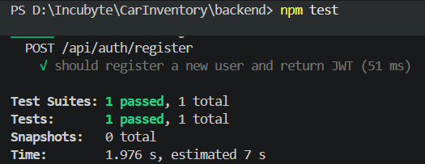 |
| Missing email | Returns `400` with `error` property | 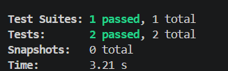 |
| Missing password | Returns `400` with `error` property | 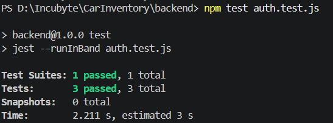 |
| User already exists | Returns `400` with `error: "User already exists"` | 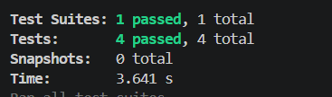 |
| Invalid email format | Returns `400` with `error: "Invalid email format"` | 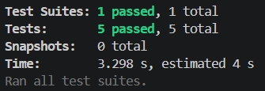 |
| Weak password (fails complexity rules) | Returns `400` with `error: "Password must be at least 8 characters, contain one uppercase letter, and one special character"` | 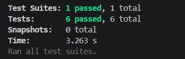 |

 ### /api/auth/login

| Test Case | Expected Result | Screenshot |
|-----------|----------------|-------------|
| Login successfully with valid credentials | Returns `200` and a JWT token in response body | 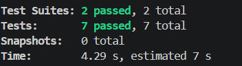 |
| Missing password (or missing fields) and Nonexistent email (invalid credentials | Returns `400` with `error` property or Returns `400` with `error: "Invalid credentials"`| 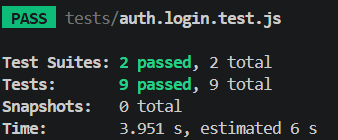 |

### Vehicle API Endpoints

| Test Cases | Expected Results | Screenshot |
|------------|-----------------|-------------|
| Add a new vehicle (Admin only) | Returns `201` and response body includes `id` | 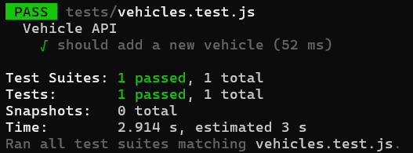 |
| List all vehicles, Update a vehicle | Returns `200` with array of vehicles; Update reflects new field values (e.g., `price`) | 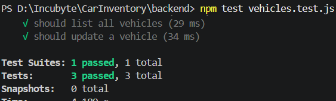 |
| Search vehicles, Delete vehicle, Purchase vehicle, Restock vehicle | Search returns array of matches; Delete returns `204`; Purchase decreases quantity; Restock increases quantity | 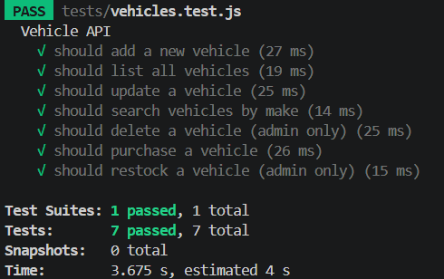 |

## Screenshots

- **Register/Login Page**  
  Users can create an account or log in to access the system.  
  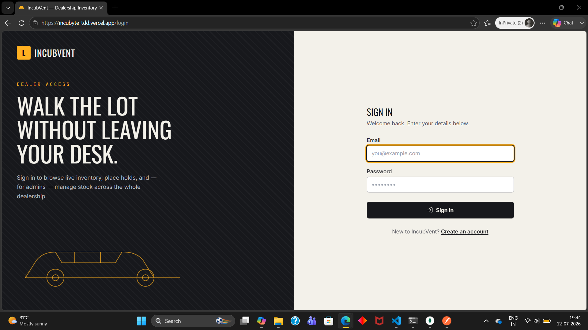

- **User Homepage (The Lot)**  
  Displays available vehicles, search functionality, and purchase option.  
  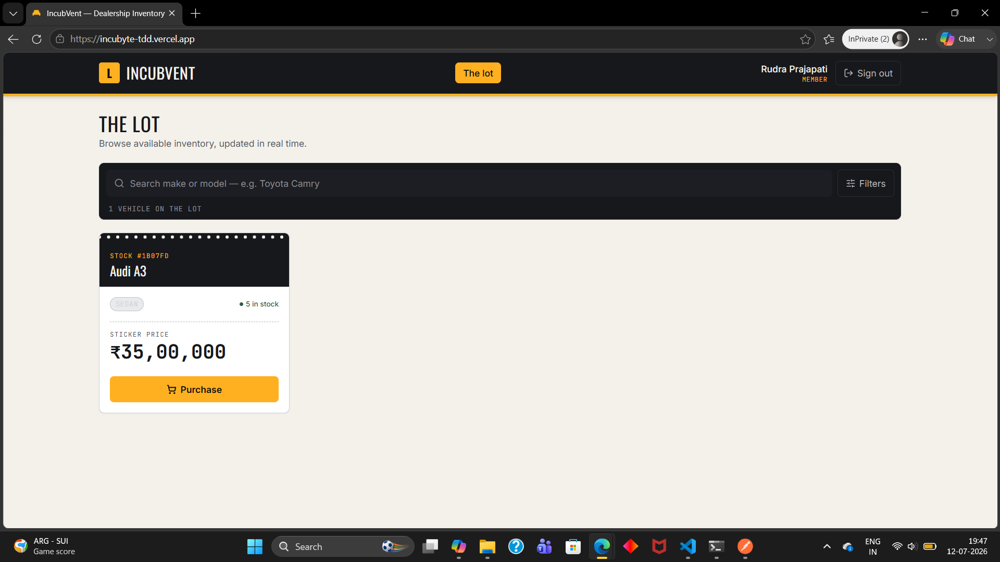

- **Admin Manage Inventory Panel**  
  Admin-only view to add, edit, restock, or remove vehicles.  
  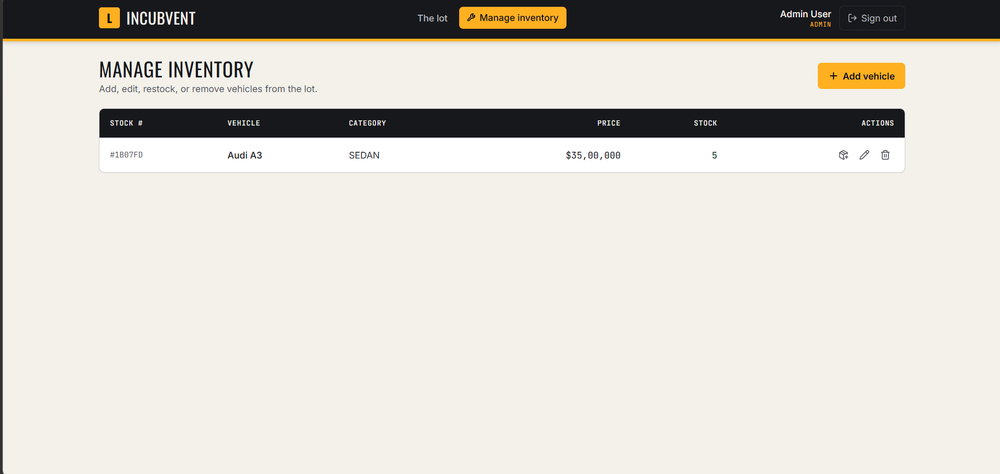

---

## My AI Usage 🤖
I used multiple AI tools responsibly:
- **Claude AI:** Assisted in backend logic brainstorming.
- **GitHub Copilot:** Helped generate frontend boilerplate and UI components.
- **Microsoft Copilot (ChatGPT):** Provided debugging advice and endpoint structuring.
- **Gemini:** Used for backend suggestions and test case generation.

## Reflection on how TDD Helped Shape the Project

Following a strict Test-Driven Development (TDD) workflow gave me deeper insight into the structure and flow of this project:

- **Clearer Project Boundaries**  
  Writing tests first forced me to think about the API contracts and data flow before coding. This helped define clean separation between controllers, services, and models.

- **Incremental Development**  
  The Red–Green–Refactor cycle kept progress small and manageable. Each commit narrates a story: failing test → minimal implementation → refactor. This made the repository history a clear learning artifact.

- **Error Handling Awareness**  
  By anticipating failure cases in tests (missing fields, invalid credentials, weak passwords), I realized how important it is to design robust validation and consistent error responses early.

- **Confidence in Refactoring**  
  With tests covering endpoints, I could restructure code (e.g., middleware, DTOs, role-based checks) without fear of breaking functionality.

- **Documentation Through Tests**  
  The test suite itself became living documentation of expected behaviors. Anyone reading the tests can understand the intended use of each endpoint.

Overall, TDD didn’t just improve code quality — it helped me **see the project as a set of well-defined modules with clear responsibilities**, making the backend and frontend easier to extend and maintain.

